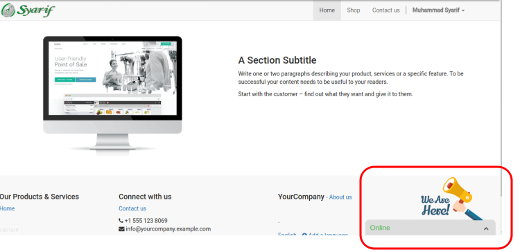
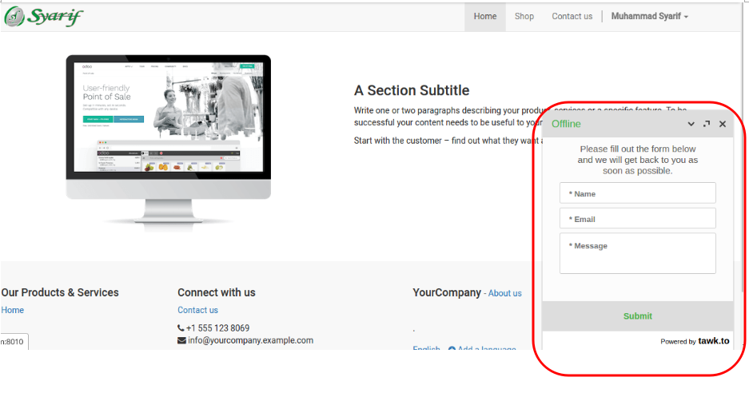
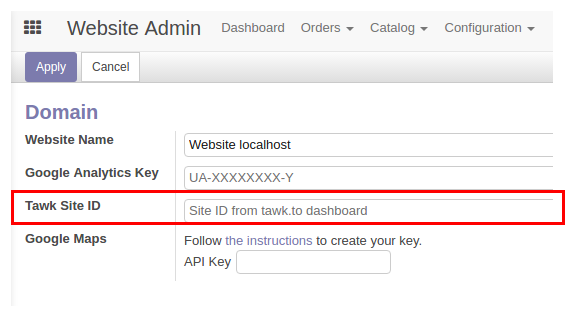

# website_odoo_tawk_to
Use tawk.to service to embedded Live Chat in Odoo

# Usage
## Tutorial Youtube : <a href="https://www.youtube.com/watch?v=2O7agyv4AhQ" target="_blank">link</a>
## Website Admin => Configuration => Settings

